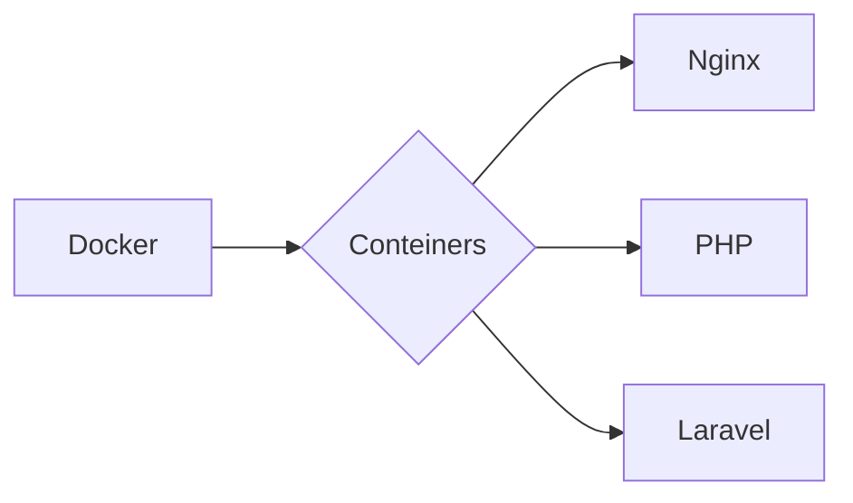

# Sobre o Projeto:
Estudos utilizando o Docker + PHP

- Nginx
- Docker Compose
- Laravel

### NGINX

```
1º - 
2º - 
3º -
```

### DOCKER COMPOSE

```
1º - Iniciar docker: docker-compose up
2º - Url: http://app.localhost/
3º -
```

### LARAVEL

```
1º - Build:  docker-compose up -d --build
2º - Create laravel project: docker-compose run composer create-project --prefer-dist laravel/laravel 
3º - 
```


### FLUXOGRAMA/DIAGRAMA




### FONTE:
Ambiente de desenvolvimento Docker - Github: (url: https://github.com/marcossaore/ambiente-dev-docker)
Ambiente de desenvolvimento Docker - Medium: (url: https://medium.com/4yousee/infraestrutura-em-ambiente-de-desenvolvimento-com-docker-parte-1-eb28507d5eca)


### 1.0 - CICLO DE VIDA

<ul>
  
  <li>
    <p><b><code>Tutorial de configuração de ambiente de desenvolvimento no Docker.</code></b></p>
    <p><i>URL: https://github.com/marcossaore/ambiente-dev-docker </i></p>
  </li>
  
  <li>
    <p><b><code>Configuração de Ambiente PHP 7 e Nginx com Docker.</code></b></p>
    <p><i>URL: https://medium.com/4yousee/infraestrutura-em-ambiente-de-desenvolvimento-com-docker-parte-1-eb28507d5eca  </i></p>
  </li> 
  
</ul>

